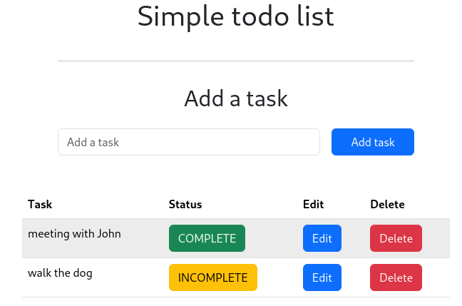
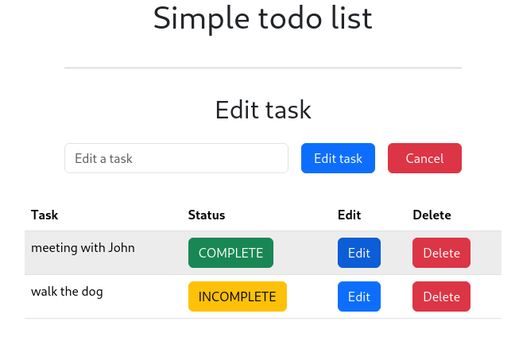

# Project Name

Simple API with Java, Spring Boot, Maven, Flyway, and SQL

# Preview



## Description

This project is a simple API developed with Java and the technologies Spring Boot, Maven, Flyway, and SQL. The API provides services to interact with a SQL database and can be used as a starting point for building web applications or RESTful services.

## Technologies Used

- Java
- Spring Boot
- Maven
- Flyway (for database migrations)
- SQL (relational database)

## Requirements

- Java Development Kit (JDK)
- Maven
- An SQL database server (e.g., MySQL, PostgreSQL, H2, etc.)

## Installation

1. Clone this repository to your local machine:

```bash
git clone https://github.com/your-username/your-project.git

